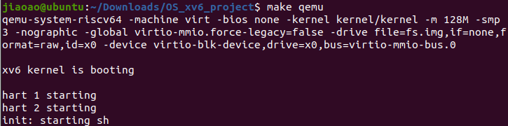

# boot xv6

本人选择了MIT-xv6-2022年的Lab项目作为本次操作系统课程设计的内容。最初的时候本人使用Macbook配置环境，但是由于M1芯片的缘故，按照官方教程无法配置成功，安装gnu-toolchain的时候总是出问题，所以我换成了Windows安装Ubuntu虚拟机的方式配置环境，首先下载了`VMware workstation 2017`作为虚拟机管理软件，然后安装了`ubuntu-20.04.5-desktop-amd64` 虚拟机。最后`make qemu`成功,截图如下：
